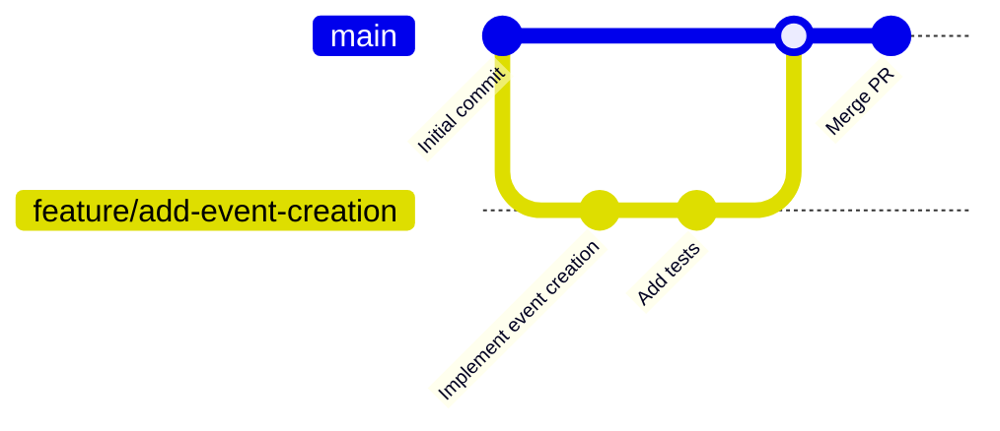

# Contributing

## Table of Contents

- [Sprint Cycle](#sprint-cycle)
- [Git Workflow](#git-workflow)
- [Deployment](#deployment)
- [License](#license)
- [GitHub Projects](#github-projects)

## Sprint Cycle

We follow a weekly sprint cycle (1-week sprints) with the following structure:

### Sprint Activities

1. **Sprint Planning**: At the beginning of each sprint, the team plans the work for the week, assigns tasks, and sets sprint goals.

2. **Customer Meeting**: Meeting with the customer to gather feedback, discuss requirements, and ensure alignment with project goals.

3. **Ad-hoc Syncs**: When a critical blocker appears, the team holds ad-hoc syncs to resolve it quickly.

### Sprint Process

- Tasks that are not completed in one iteration are moved to the next sprint.
- Team members assign tasks to themselves during meetings.

## Git Workflow

We use [GitHub Flow](https://docs.github.com/en/get-started/using-github/github-flow) for our development workflow. This simple branching model is well-suited for our project because it enables fast iteration, is easy to understand, and works well for small teams.

### Branching Strategy

Our branching strategy follows GitHub Flow:



**Workflow Steps:**

1. Create a feature branch from `main`:

   ```bash
   git checkout main
   git pull origin main
   git checkout -b feature/your-feature-name
   ```

2. Make your changes and commit them to your feature branch.

3. Push your branch and create a Pull Request (PR) to `main`.

4. After all CI checks pass, the PR can be merged into `main`.

### Branch Protection Rules

- **Require branches to be up to date**: Feature branches must be up to date with `main` before merging.
- **Require CI checks to pass**: All CI checks must pass before merging.

### Commit Message Format

Free format

### Issue Templates

We use structured issue templates to ensure consistency and completeness. Issue templates are organized in a hierarchy:

#### Issue Hierarchy

- **Epic**: Large initiatives that span multiple sprints. Epics contain Backlog items.
- **Backlog**: Product Backlog Items (PBIs) that fit into a single sprint. Backlog items contain Tasks.
- **Task**: Specific, actionable work items that can be completed in a short time.

**Hierarchy Flow:** Epic → Backlog → Task

#### Available Issue Templates

**Epic Types:**

- Epic: User Story
- Epic: Bug Report
- Epic: Enabler
- Epic: Tech Debt
- Epic: Investigation

**Backlog Types:**

- Backlog: User Story
- Backlog: Bug Report
- Backlog: Enabler
- Backlog: Tech Debt
- Backlog: Investigation

**Task Type:**

- Task

Issue templates are located in the [.github/ISSUE_TEMPLATE/](https://github.com/Inno-Cringineers/.github/tree/main/.github/ISSUE_TEMPLATE) directory. When creating an issue, select the appropriate template based on the issue type and hierarchy level.

### Pull Request Templates

We have two pull request templates:

1. **Task Template** (`task.md`): For regular pull requests that resolve a Task issue.

   - Must reference the related Task issue
   - Includes subtasks checklist
   - Includes acceptance criteria verification

2. **Last-Minute Changes Template** (`last-minute-changes.md`): For urgent changes that don't have a related issue.
   - Used sparingly for critical fixes or urgent updates
   - Still requires all CI checks to pass

Pull request templates are located in the [.github/PULL_REQUEST_TEMPLATE/](https://github.com/Inno-Cringineers/.github/tree/main/.github/PULL_REQUEST_TEMPLATE) directory.

### Pull Request Merge Requirements

Before a pull request can be merged, it must meet the following requirements:

1. **Issue Reference**: The PR must reference the related issue it resolves (except for last-minute changes).

2. **Acceptance Criteria Verification**: All acceptance criteria from the related issue must be met and verified.

3. **CI Checks**: All CI checks must pass successfully.

## Deployment

This project is a **self-hosted application**. Each user runs their own instance of the application, so there are no traditional staging or production environments managed by the development team.

### Self-Hosting Deployment

Users deploy the application using Docker Compose. This process is documented in the [README.md](./README.md) file.

**Key Points:**

- Users must have Docker and Docker Compose installed
- Each user configures their own instance
- No CI/CD pipeline to staging/production is needed since it's self-hosted

### Making the App Available to Stakeholders

For detailed deployment instructions, please refer to the [README.md](./README.md) file.

Stakeholders can try bot via developer computer or demo bot (ask [@Yura_Rrrr](https://t.me/Yura_Rrrr))

## License

This project uses the **MIT License**. The full license text can be found in [LICENSE.md](./LICENSE.md).

### Why MIT License?

We chose the MIT License for the following reasons:

1. **Open-Source**: The project is free and open-source and use the MIT license.

2. **Permissive Nature**: The MIT License is permissive and encourages contributions by allowing others to use, modify, and distribute the code with minimal restrictions.

3. **Simplicity**: It is simple, widely understood, and doesn't require complex legal interpretation.

By contributing to this project, you agree that your contributions will be licensed under the MIT License.

## GitHub Projects

We use GitHub Projects to track and manage our work. We have two main projects:

### Project Structure

1. [**Backlog Project:**](https://github.com/orgs/Inno-Cringineers/projects/14)

   - **Purpose**: Tracks sprints
   - **Issue Types**: Backlog issues
   - **Views**: Board view for sprint planning, Roadmap view for long-term planning

2. [**Tasks Project:**](https://github.com/orgs/Inno-Cringineers/projects/15)
   - **Purpose**: Tracks individual tasks
   - **Issue Types**: Task issues
   - **Views**: Board view for task management

### View Order and Purpose

**Backlog Project Views:**

1. **Board View**: Used for sprint planning and tracking progress of Backlog items during sprints.
2. **Roadmap View**: Used for long-term planning and visualizing the overall project timeline.

**Tasks Project Views:**

1. **Board View**: Used for managing and tracking individual tasks, organized by status (To Do, In Progress, Done, etc.).
