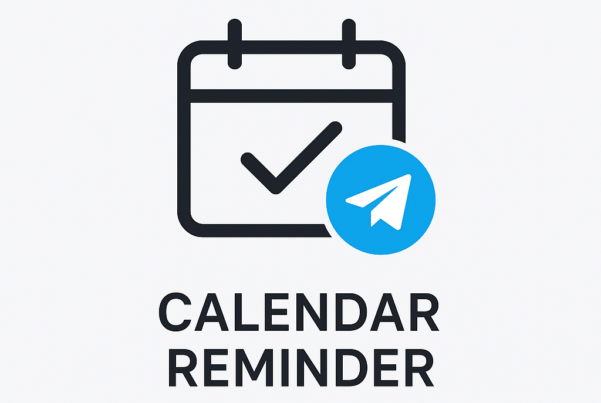
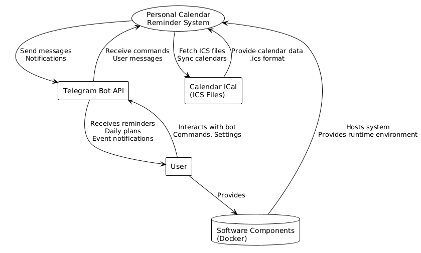

<p align="center">
  
</p>

# Personal Calendar Reminder &middot;  &middot; [](https://inno-cringineers.github.io/Telegram_Calendar/)

A telegram bot as a frontend for the joint calendar and calendar synchronization plugins that can go and collect info from your calendars.

## Description

The project is a self-hosted solution that allows the user to run it on their server and get a service for working with events and reminders. User gets the opportunity to perform CRUD operations on events through the interface of the telegram bot. The telegram bot will notify the user about upcoming events at the frequency specified by the user, and send plans for the day. The service allows you to integrate data from existing calendars (Google, Outlook).

## Reminder Context Diagram

<div align="center">
    
</div>

# Documentation

will be soon - user guides will be added when project will be created

# How to build and run project

1) clone github.com/Inno-Cringineers/Telegram_Calendar repository (if you dont know how - just google "How to clone repository from github")
2) make bot via @BotFather and copy bot token (if you dont know how - just google "How to nake telegram bot via @BotFather and copy bot token")
3) install docker and docker-compose (if you dont know how - just google "How to install docker and docker-compose")
4) make .env file and add variable with token to it: 
``` 
TELEGRAM_TOKEN=insert_your_token_here
```
5) run this command (change path to docker-compose file (he is in ./app/src/) and path to your .env file):
```
docker compose -f path/to/docker-compose.yml --env-file path/to/.env up
```
6) write /start to bot and enjoy "hello world!"

# Links

- [Sprints](./docs/sprints) - information about meetings with the customer and meeting reports
- [AI usage](./docs/ai-usage.md) - how we use AI in this project.
- [The guide](./guide/README.md) - Readme from guide