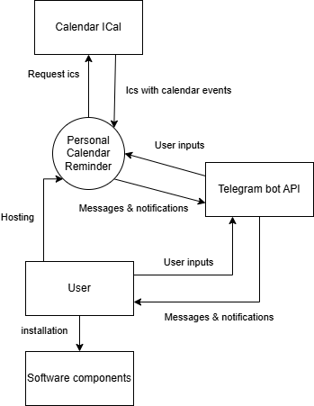

<p align="center">
  
</p>

# Personal Calendar Reminder &middot; 

A telegram bot as a frontend for the joint calendar and calendar synchronization plugins that can go and collect info from your calendars.

## Project goal

Provide to users a tool to create their own planning service (self hosted). Which will Combine notifications from multiple calendars in one place (telegram bot) and provide the opportunity to perform CRUD operations with events and receive reminders centralized from all provided calendars and events.

MVP features have to be done before ITPD Course finish (19.12.2025)

## Threshold of Success

- **Time:** Project have to be done before ITPD Course finish (19.12.2025)
- **Budget:** Opensource project (0 rubles)
- **Scope:**: The app matches the critical features listed in the Feature Roadmap
- **Quality:**: The application meets non-functional requirements and quality attributes

## Description

The project is a self-hosted solution that allows the user to run it on their server and get a service for working with events and reminders. User gets the opportunity to perform CRUD operations on events through the interface of the telegram bot. The telegram bot will notify the user about upcoming events at the frequency specified by the user, and send plans for the day. The service allows you to integrate data from existing calendars (Google, Outlook).

## Reminder Context Diagram

<div align="center">
    
</div>

## Feature Roadmap

Key Features Identified:

- [ ] Reminders with configurable number of time before an event.
- [ ] Time zones support (manual user setting).
- [ ] A "Daily Plan" feature - a summary of the day's events sent at a user-defined time.
- [ ] Integration with calendars via standardized iCal (ICS) format files.
- [ ] Integration with calendars via OAuth methods (if integratuin via ICS failed)
  - [ ] Outlook
  - [ ] Google
- [ ] Ability to add, edit, and delete events directly within the bot (these events will be stored internally in the bot's database, not synced to external calendars).
- [ ] Users must be able to export their internally-created events, likely in JSON or ICS format, for backup or transfer.
- [ ] Event Viewing: Users will primarily view all events by clicking a provided link that opens their calendar.
- [ ] Notifications are for private chats only. Support for group chats was deferred for future consideration.
- [ ] Quiet Hours: A "Do Not Disturb" feature to mute notifications during specific hours was agreed upon as a useful addition.
- [ ] Write user guides

# Documentation

will be soon - user guides will be added when project will be created

# How to build and run project

1) clone github.com/Inno-Cringineers/Telegram_Calendar repository (if you dont know how - just google "How to clone repository from github")
2) make bot via @BotFather and copy bot token (if you dont know how - just google "How to nake telegram bot via @BotFather and copy bot token")
3) install docker and docker-compose (if you dont know how - just google "How to install docker and docker-compose")
4) make .env file and add variable with token to it: 
``` 
TELEGRAM_TOKEN=insert_your_token_here
```
5) run this command (change path to docker-compose file (he is in ./app/src/) and path to your .env file):
```
docker compose -f path/to/docker-compose.yml --env-file path/to/.env up
```
6) write /start to boot and enjoy "hello world!"

# Links

- [Sprints](./docs/sprints) - information about meetings with the customer and meeting reports
- [AI usage](./docs/ai-usage.md) - how we use AI in this project.
