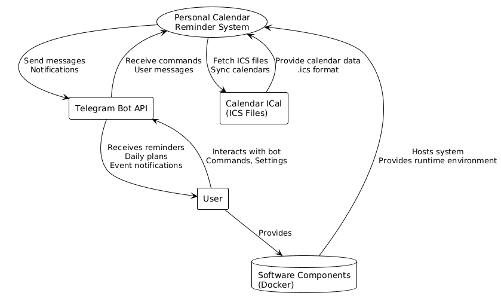

<p align="center">
  
</p>

# Personal Calendar Reminder &middot;  &middot; [](https://inno-cringineers.github.io/Telegram_Calendar/) &middot; [](https://codecov.io/gh/Inno-Cringineers/Telegram_Calendar)

A telegram bot as a frontend for the joint calendar and calendar synchronization plugins that can go and collect info from your calendars.

## Description

The project is a self-hosted solution that allows the user to run it on their server and get a service for working with events and reminders. User gets the opportunity to perform CRUD operations on events through the interface of the telegram bot. The telegram bot will notify the user about upcoming events at the frequency specified by the user, and send plans for the day. The service allows you to integrate data from existing calendars (Google, Outlook).

## Reminder Context Diagram

<div align="center">
    
</div>

# Documentation

[User guide](/User_guide.md)

# How to build and run project

## Prerequisites

Before you begin, ensure you have the following installed:
- **Docker** (version 20.10 or later)
- **Docker Compose** (version 2.0 or later)
- **Git** (for cloning the repository)

### Installing Docker and Docker Compose

- **Linux**: Follow the [official Docker installation guide](https://docs.docker.com/engine/install/)
- **macOS**: Install [Docker Desktop](https://www.docker.com/products/docker-desktop)
- **Windows**: Install [Docker Desktop](https://www.docker.com/products/docker-desktop)

## Step-by-Step Setup Guide

### Step 1: Clone the Repository

```bash
git clone https://github.com/Inno-Cringineers/Telegram_Calendar.git
cd Telegram_Calendar
```

### Step 2: Create a Telegram Bot

1. Open Telegram and search for [@BotFather](https://t.me/BotFather)
2. Send `/newbot` command
3. Follow the instructions to set a name and username for your bot
4. Copy the bot token that BotFather provides (it looks like `123456789:ABCdefGHIjklMNOpqrsTUVwxyz`)

### Step 3: Create Environment File

Create a `.env` file in the `app/` directory with the following variables:

```bash
cd app
nano .env  # or use your preferred text editor
```

> **📖 For detailed information about all environment variables, see the [Environment Variables Reference](#environment-variables-reference) section below.**

**Minimum required configuration:**

```env
# Required: Telegram Bot Token (obtained from @BotFather)
TELEGRAM_TOKEN=your_bot_token_here
```

**Full configuration example with all optional variables:**

```env
# ============================================
# REQUIRED VARIABLES
# ============================================

# Telegram Bot Token (obtained from @BotFather)
# This is the only required variable
TELEGRAM_TOKEN=123456789:ABCdefGHIjklMNOpqrsTUVwxyz

# ============================================
# DATABASE CONFIGURATION
# ============================================

# PostgreSQL connection settings
POSTGRES_USER=postgres                    # Default: postgres
POSTGRES_PASSWORD=postgres                # Default: postgres
POSTGRES_DB=telegram_calendar             # Default: telegram_calendar
POSTGRES_HOST=postgres                    # Default: postgres (service name in docker-compose)
POSTGRES_PORT=5432                        # Default: 5432 (internal port inside Docker network)
POSTGRES_HOST_PORT=5432                   # Default: 5432 (external port on host machine)

# ============================================
# BOT CONFIGURATION
# ============================================

# ============================================
# SYNC CONFIGURATION
# ============================================

# SYNC_INTERVAL - Time in seconds between calendar synchronization cycles
# The sync service periodically checks all enabled external calendars (ICS files)
# and updates events in the database. This interval determines how often this check occurs.
# Lower values = more frequent updates (more server load, more up-to-date data)
# Higher values = less frequent updates (less server load, may miss recent changes)
# Recommended: 60 seconds (1 minute) for most use cases
SYNC_INTERVAL=60                          # Default: 60 seconds (1 minute)

# SYNC_WORKERS - Number of asynchronous workers for calendar synchronization
# Multiple calendars can be synced in parallel using worker threads.
# Each worker processes one calendar at a time from the sync queue.
# More workers = faster sync for multiple calendars, but higher resource usage
# Recommended: 2 workers for most deployments (can increase if you have many calendars)
SYNC_WORKERS=2                            # Default: 2 workers

# ============================================
# METRICS CONFIGURATION
# ============================================

# METRICS_INTERVAL - Time in seconds between metrics collection cycles
# The metrics service periodically collects statistics from the database:
# - User language distribution
# - Events count (with/without external calendar URLs)
# These metrics are exported to Grafana via OpenTelemetry (if configured)
# Recommended: 300 seconds (5 minutes) for most deployments
METRICS_INTERVAL=300                      # Default: 300 seconds (5 minutes)

# ============================================
# USER RESTRICTION
# ============================================

# Enable user whitelist (restrict bot access to whitelisted users only)
USER_RESTRICTION_ENABLED=false            # Default: false
WHITELIST_PATH=/app/whitelist.json       # Default: /app/whitelist.json (path inside container)
WHITELIST_HOST_PATH=./whitelist.json     # Default: ./whitelist.json (path on host machine)

# ============================================
# LOGGING
# ============================================

# Log level: DEBUG, INFO, WARNING, ERROR, CRITICAL
LOG_LEVEL=INFO                            # Default: INFO

# ============================================
# DEVELOPMENT MODE
# ============================================

# Enable hot reload (auto-restart on file changes)
# Set to "true" for development, "false" for production
DEV_MODE=false                            # Default: false

# ============================================
# TIMEZONE
# ============================================

# System timezone for Docker container (affects logs, system calls, etc.)
# Timezone in IANA format (e.g., Europe/Moscow, Asia/Almaty, America/New_York)
# If not set, will use timezone from host machine's /etc/localtime
# 
# Why IANA format instead of UTC offset (like UTC+3)?
# - IANA format (e.g., Europe/Moscow) automatically handles:
#   * Daylight Saving Time (DST) transitions
#   * Historical timezone changes
#   * Regional timezone rules
# - UTC offset (e.g., UTC+3) is static and doesn't account for:
#   * DST changes (would need manual updates twice a year)
#   * Historical timezone adjustments
#   * Regional variations
#
# Note: This is for the CONTAINER's system timezone (logs, system calls).
# User timezone settings in the bot use UTC offset format (UTC+3) for simplicity.
TZ=Europe/Moscow                          # Optional: leave empty to use system timezone

# ============================================
# OPENTELEMETRY / MONITORING (Optional)
# ============================================

# OpenTelemetry Protocol (OTLP) configuration for exporting metrics and logs to Grafana
# 
# What is OTLP?
# OTLP (OpenTelemetry Protocol) is a standard protocol for sending telemetry data
# (metrics, logs, traces) to observability platforms like Grafana Cloud.
#
# What data is exported?
# - Custom metrics: User language distribution, events counts
# - Application logs: User interactions, errors, debug information
# - Automatic metrics: Database performance, async operations, system metrics
#
# How to set up Grafana Cloud:
# 1. Sign up at https://grafana.com/auth/sign-up/create-user
# 2. Create a stack and get your OTLP endpoint URL
# 3. Generate an API key with "Metrics" and "Logs" permissions
# 4. Configure the variables below with your Grafana Cloud credentials
#
# Example Grafana Cloud configuration:
# OTEL_EXPORTER_OTLP_ENDPOINT=https://otlp-gateway-prod-eu-west-0.grafana.net/otlp
# OTEL_EXPORTER_OTLP_HEADERS=Authorization=Basic <base64-encoded-api-key>
# OTEL_EXPORTER_OTLP_PROTOCOL=http/protobuf
#
# Leave empty if not using monitoring/observability
OTEL_RESOURCE_ATTRIBUTES=                # Optional: Resource attributes (e.g., "service.name=telegram-calendar")
OTEL_EXPORTER_OTLP_ENDPOINT=             # Optional: OTLP endpoint URL (from Grafana Cloud)
OTEL_EXPORTER_OTLP_HEADERS=              # Optional: OTLP headers (e.g., "Authorization=Basic <api-key>")
OTEL_EXPORTER_OTLP_PROTOCOL=http/protobuf # Optional: Protocol type - "http/protobuf" or "grpc" (default: http/protobuf)

# ============================================
# PGADMIN CONFIGURATION (Optional)
# ============================================

# PgAdmin is a web-based administration tool for PostgreSQL databases
# It provides a user-friendly interface to manage your database, run queries, and view data
# Access it at http://localhost:<PGADMIN_PORT> after starting the containers

PGADMIN_DEFAULT_EMAIL=admin@admin.com     # Default: admin@admin.com (login email)
PGADMIN_DEFAULT_PASSWORD=admin            # Default: admin (login password - change in production!)
PGADMIN_PORT=5050                         # Default: 5050 (web interface port)
```

### Step 4: Configure Whitelist (Optional)

If `USER_RESTRICTION_ENABLED=true` (disabled by default), create or edit `app/whitelist.json`:

```json
{
    "usernames": [
        "@your_telegram_username",
        "@another_user"
    ]
}
```

Or use a simple list format:

```json
[
    "@your_telegram_username",
    "@another_user"
]
```

**Note:** Usernames should start with `@`. If you omit the `@`, it will be added automatically.

### Step 5: Build and Run with Docker Compose

Navigate to the `app/` directory and start the services:

```bash
cd app
docker compose -f docker-compose.yml --env-file .env up -d
```

**For staging environment:**

```bash
docker compose -f docker-compose.stage.yml --env-file .env up -d
```

**Explanation of the command:**
- `-f docker-compose.yml`: Specifies the compose file to use
- `--env-file .env`: Loads environment variables from `.env` file
- `-d`: Runs containers in detached mode (in the background)

### Step 6: Verify the Setup

1. **Check container status:**
   ```bash
   docker compose -f docker-compose.yml ps
   ```

2. **View bot logs:**
   ```bash
   docker compose -f docker-compose.yml logs -f bot
   ```

3. **View PostgreSQL logs:**
   ```bash
   docker compose -f docker-compose.yml logs -f postgres
   ```

4. **Test the bot:**
   - Open Telegram and search for your bot by username
   - Send `/start` command
   - You should receive a welcome message

### Step 7: Access PgAdmin (Optional)

If you want to manage the database via web interface:

1. Open your browser and navigate to: `http://localhost:5050` (or the port specified in `PGADMIN_PORT`)
2. Login with:
   - Email: Value from `PGADMIN_DEFAULT_EMAIL` (default: `admin@admin.com`)
   - Password: Value from `PGADMIN_DEFAULT_PASSWORD` (default: `admin`)
3. Add a new server:
   - Host: `postgres` (service name)
   - Port: `5432`
   - Database: Value from `POSTGRES_DB` (default: `telegram_calendar`)
   - Username: Value from `POSTGRES_USER` (default: `postgres`)
   - Password: Value from `POSTGRES_PASSWORD` (default: `postgres`)

## Managing the Application

### Stop the application:
```bash
docker compose -f docker-compose.yml down
```

### Stop and remove volumes (⚠️ This will delete all data):
```bash
docker compose -f docker-compose.yml down -v
```

### Restart the application:
```bash
docker compose -f docker-compose.yml restart
```

### View logs:
```bash
# All services
docker compose -f docker-compose.yml logs -f

# Specific service
docker compose -f docker-compose.yml logs -f bot
docker compose -f docker-compose.yml logs -f postgres
```

### Rebuild after code changes if DEV_MODE is false:
```bash
docker compose -f docker-compose.yml up -d --build
```

## Environment Variables Reference

### Required Variables

| Variable | Description | Example |
|----------|-------------|---------|
| `TELEGRAM_TOKEN` | Telegram bot token from @BotFather | `123456789:ABCdefGHIjklMNOpqrsTUVwxyz` |

### Database Variables

| Variable | Description | Default | Required |
|----------|-------------|---------|----------|
| `POSTGRES_USER` | PostgreSQL username | `postgres` | No |
| `POSTGRES_PASSWORD` | PostgreSQL password | `postgres` | No |
| `POSTGRES_DB` | Database name | `telegram_calendar` | No |
| `POSTGRES_HOST` | Database host (service name in docker-compose) | `postgres` | No |
| `POSTGRES_PORT` | Internal database port inside Docker network | `5432` | No |
| `POSTGRES_HOST_PORT` | External database port on host machine (used for local connections like `localhost:<port>`) | `5432` | No |

### Bot Configuration Variables

| Variable | Description | Default | Required |
|----------|-------------|---------|----------|
| `SYNC_INTERVAL` | Time in seconds between calendar synchronization cycles. The sync service periodically checks all enabled external calendars (ICS files) and updates events in the database. Lower values = more frequent updates (more server load). Higher values = less frequent updates (less server load). Recommended: 60 seconds (1 minute). | `60` | No |
| `SYNC_WORKERS` | Number of asynchronous workers for calendar synchronization. Multiple calendars can be synced in parallel using worker threads. Each worker processes one calendar at a time from the sync queue. More workers = faster sync for multiple calendars, but higher resource usage. Recommended: 2 workers for most deployments. | `2` | No |
| `METRICS_INTERVAL` | Time in seconds between metrics collection cycles. The metrics service periodically collects statistics from the database (user language distribution, events counts) and exports them to Grafana via OpenTelemetry (if configured). Recommended: 300 seconds (5 minutes). | `300` | No |

### User Restriction Variables

| Variable | Description | Default | Required |
|----------|-------------|---------|----------|
| `USER_RESTRICTION_ENABLED` | Enable user whitelist feature. When `true`, only users listed in the whitelist file can interact with the bot. When `false`, all users can use the bot. | `false` | No |
| `WHITELIST_PATH` | Path to whitelist JSON file inside the Docker container. This is where the application looks for the whitelist file. | `/app/whitelist.json` | No |
| `WHITELIST_HOST_PATH` | Path to whitelist JSON file on the host machine. This path is mounted into the container via Docker volume. Changes to this file are automatically detected (hot reload). | `./whitelist.json` | No |

### Logging Variables

| Variable | Description | Default | Required |
|----------|-------------|---------|----------|
| `LOG_LEVEL` | Logging verbosity level. Controls which log messages are displayed: `DEBUG` (most verbose, includes all details), `INFO` (general information), `WARNING` (warnings only), `ERROR` (errors only), `CRITICAL` (critical errors only). Recommended: `DEBUG` for development, `INFO` or `WARNING` for production. | `INFO` | No |

### Development Variables

| Variable | Description | Default | Required |
|----------|-------------|---------|----------|
| `DEV_MODE` | Enable hot reload mode. When `true`, the application automatically restarts when source code files change (useful for development). When `false`, runs in production mode with OpenTelemetry instrumentation. | `false` | No |

### Timezone Variables

| Variable | Description | Default | Required |
|----------|-------------|---------|----------|
| `TZ` | System timezone for Docker container in IANA format (e.g., `Europe/Moscow`, `Asia/Almaty`, `America/New_York`). Affects logs and system calls. Uses IANA format to automatically handle DST transitions and historical changes. | System timezone from `/etc/localtime` | No |

**Note:** This variable sets the **container's system timezone** (for logs, system calls). User timezone preferences in the bot use UTC offset format (e.g., `UTC+3`) stored in the database. The IANA format is used here because it automatically handles Daylight Saving Time transitions and historical timezone changes, unlike static UTC offsets.

### OpenTelemetry Variables (Optional)

**What is OTLP?**  
OTLP (OpenTelemetry Protocol) is a standard protocol for sending telemetry data (metrics, logs, traces) to observability platforms like Grafana Cloud.

**What data is exported?**
- Custom metrics: User language distribution, events counts
- Application logs: User interactions, errors, debug information  
- Automatic metrics: Database performance, async operations, system metrics

**How to set up Grafana Cloud:**
1. Sign up at https://grafana.com/auth/sign-up/create-user
2. Create a stack and get your OTLP endpoint URL
3. Generate an API key with "Metrics" and "Logs" permissions
4. Configure the variables below with your Grafana Cloud credentials

| Variable | Description | Default | Required |
|----------|-------------|---------|----------|
| `OTEL_RESOURCE_ATTRIBUTES` | OpenTelemetry resource attributes for identifying the service (e.g., `service.name=telegram-calendar,service.version=1.0.0`) | - | No |
| `OTEL_EXPORTER_OTLP_ENDPOINT` | OTLP endpoint URL from Grafana Cloud (e.g., `https://otlp-gateway-prod-eu-west-0.grafana.net/otlp`) | - | No |
| `OTEL_EXPORTER_OTLP_HEADERS` | OTLP headers for authentication (e.g., `Authorization=Basic <base64-encoded-api-key>`). For Grafana Cloud, use format: `Authorization=Basic <base64-encoded-instance-id:api-key>` | - | No |
| `OTEL_EXPORTER_OTLP_PROTOCOL` | OTLP protocol type: `http/protobuf` (recommended) or `grpc` | `http/protobuf` | No |

### PgAdmin Variables

**What is PgAdmin?**  
PgAdmin is a web-based administration tool for PostgreSQL databases. It provides a user-friendly interface to manage your database, run queries, and view data.

| Variable | Description | Default | Required |
|----------|-------------|---------|----------|
| `PGADMIN_DEFAULT_EMAIL` | Email address for logging into PgAdmin web interface. This is the username for PgAdmin authentication. | `admin@admin.com` | No |
| `PGADMIN_DEFAULT_PASSWORD` | Password for logging into PgAdmin web interface. **Important:** Change this in production! | `admin` | No |
| `PGADMIN_PORT` | Port number for accessing PgAdmin web interface. Access it at `http://localhost:<PGADMIN_PORT>`. | `5050` | No |

## Troubleshooting

### Bot doesn't respond

1. Check if the bot is running:
   ```bash
   docker compose -f docker-compose.yml ps
   ```

2. Check bot logs for errors:
   ```bash
   docker compose -f docker-compose.yml logs bot
   ```

3. Verify `TELEGRAM_TOKEN` is correct in `.env` file

4. Make sure you've started the bot in Telegram (send `/start`)

### Database connection errors

1. Check PostgreSQL container status:
   ```bash
   docker compose -f docker-compose.yml ps postgres
   ```

2. Check PostgreSQL logs:
   ```bash
   docker compose -f docker-compose.yml logs postgres
   ```

3. Verify database credentials in `.env` file match docker-compose configuration

4. The application will automatically create the database if it doesn't exist

### Whitelist not working

1. Verify `USER_RESTRICTION_ENABLED=true` in `.env` (default is `false`)
2. Check `whitelist.json` file exists and has correct format
3. Ensure usernames in whitelist match your Telegram username (with `@`)
4. Check bot logs for whitelist-related messages

### Port conflicts

If ports 5432 or 5050 are already in use:

1. Change `POSTGRES_HOST_PORT` in `.env` (e.g., `5433`) — this changes **only the external port on the host**; the bot will still connect to `postgres:5432` inside the Docker network.
2. Change `PGADMIN_PORT` in `.env` (e.g., `5051`) — this is the PgAdmin port on the host (`http://localhost:<PGADMIN_PORT>`).
3. In most cases you should not change `POSTGRES_PORT` (internal port inside the Docker network). Modify it only if you intentionally run PostgreSQL on a non-standard internal port **inside** the container and have updated all dependent services accordingly.

## Production Deployment

For production deployment:

1. Set `DEV_MODE=false` in `.env` (default is `false`)
2. Use strong passwords for `POSTGRES_PASSWORD` and `PGADMIN_DEFAULT_PASSWORD`
3. Set `LOG_LEVEL=INFO` or `WARNING` to reduce log verbosity (default is `INFO`)
4. Consider using Docker secrets or external secret management
5. Set up proper backup strategy for PostgreSQL data volume
6. Configure firewall rules to restrict access to database ports
7. Use reverse proxy (nginx/traefik) for PgAdmin if exposing it publicly

## Additional Resources

- [Docker Documentation](https://docs.docker.com/)
- [Docker Compose Documentation](https://docs.docker.com/compose/)
- [Telegram Bot API](https://core.telegram.org/bots/api)
- [PostgreSQL Documentation](https://www.postgresql.org/docs/)

# Links

- [Sprints](./docs/sprints) - information about meetings with the customer and meeting reports
- [AI usage](./docs/ai-usage.md) - how we use AI in this project.
- [The guide](./guide/README.md) - Readme from guide
