# Guide

## User guide

### Import calendars

1. Write "/start" in the tg bot.

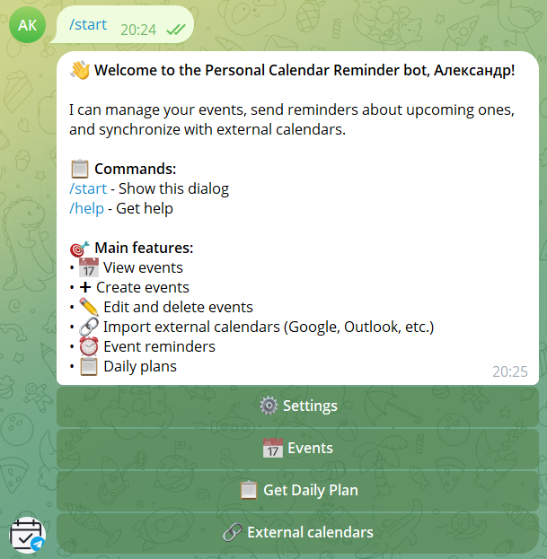

2. Press "External calendars".

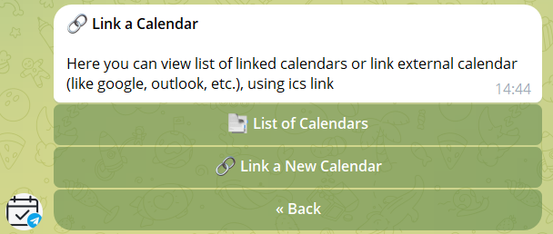

3. Press "Link a new calendar"

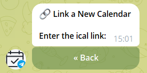

4. Enter the ical link. [Guide on how to find an ical link](#how-to-find-an-ics-link-in-different-calendars)
5. Enter name of calendar.
6. Click "Accept"

### Get daily plan

1. Write "/start" in the tg bot.

2. Click "Get Daily Plan".

### Settings

1. Write "/start" in the tg bot.

2. Click "Settings"

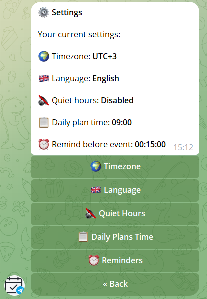

**The current settings are shown at the top**

#### Timezone

1. In settings menu click "Timezone".

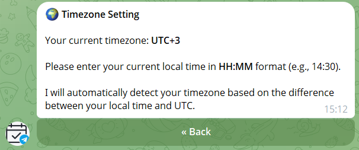

2. Write your current local time in HH:MM format фnd timezone will be determined automatically.

#### Language

1. In settings menu click "Language".

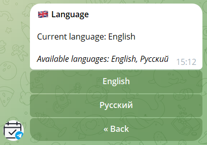

2. You can choose language. (Russian or English)

#### Quiet hours 

1. In settings menu click "Quiet hours"

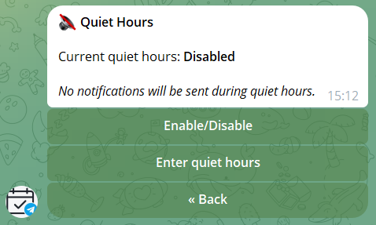

2. You can enable/disable quiet hours by press button "enable/disable".
3. You can enter quiet hours by press button "Enter quiet hours"

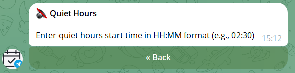

4. Enter quiet hours start time in HH:MM format.
5. Enter quiet hours end time in HH:MM format.
6. Click "Accept".

#### Daily plans Time

1. In settings menu click "Daily plans time"

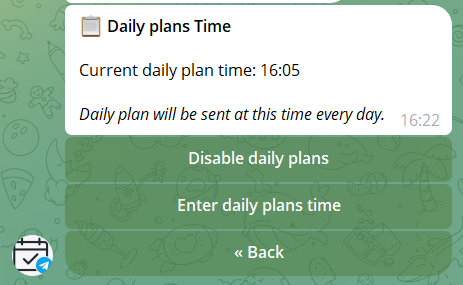

2. You can enable/disable daily plans by press button "enable/disable".

3. You can enter daily plans time by press button "Enter daily plans time"

4. Enter daily plans time in HH:MM format.
5. Click "Accept".

#### Default reminders

1. In settings menu click "Reminders"

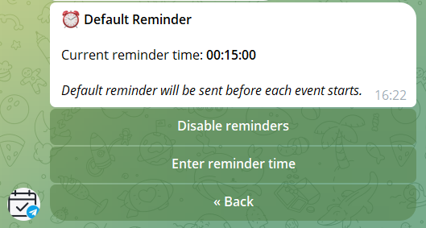

2. You can enable/disable default reminders by press button "enable/disable reminders"

3. You can enter default reminder time by press button "Enter reminder time".

4. Enter default reminder time in HH:MM:SS format (e.g., 00:15:00 for 15 minutes)
5. Click "Accept".

### Events

1. Write "/start" in the tg bot.

2. Click "Events".

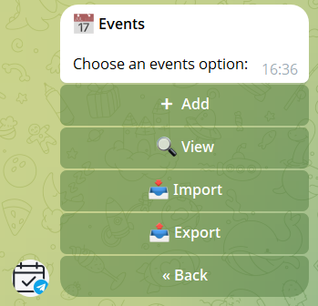

#### Add events

1. In events menu click "Add".
2. Click "Add via dialog"
3. Enter event title.
4. Enter description or click "Skip".
5. Enter start date.
6. Enter start time.
7. Enter end date.
8. Enter end time.
9. Click "Accept".

#### View events

1. In events menu click "View".
2. Press button with start date and then with end date.

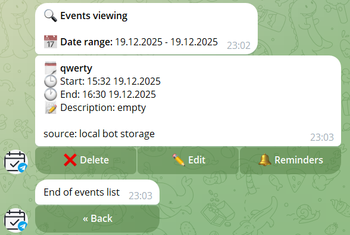

#### Import 

1. In events menu click "Import".
2. Enter file in .ics format.

#### Export 

1. In events menu Click "Export".
2. You can download file in .ics format with your events.

### New reminders

You can add reminders for each event. For this you need:

1. [View events](#view-events). 

2. Find the event for which you want to add a notification and click on the "Reminders" button.

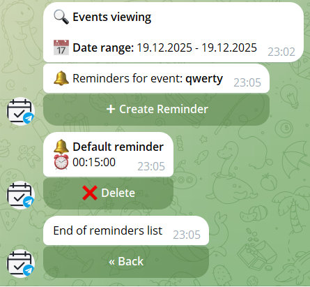

3. You can see all reminders about this event and you can add a new reminder by clicking on the "Create reminder" button.
4. Enter reminder description.
5. Enter time before event when reminder should be sent. Format: HH:MM:SS (e.g., "01:30:00" for 1 hour 30 minutes before event).
6. Click "Accept".

## How to find an ics link in different calendars

### Google calendar

1. Open your google calendar.
2. Press option for your calendar.

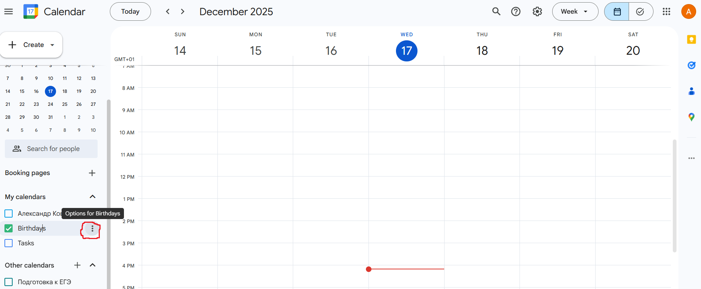

3. Press "Settings and sharing".
4. Click "Integrate calendar" and copy "secret address in ICal format".

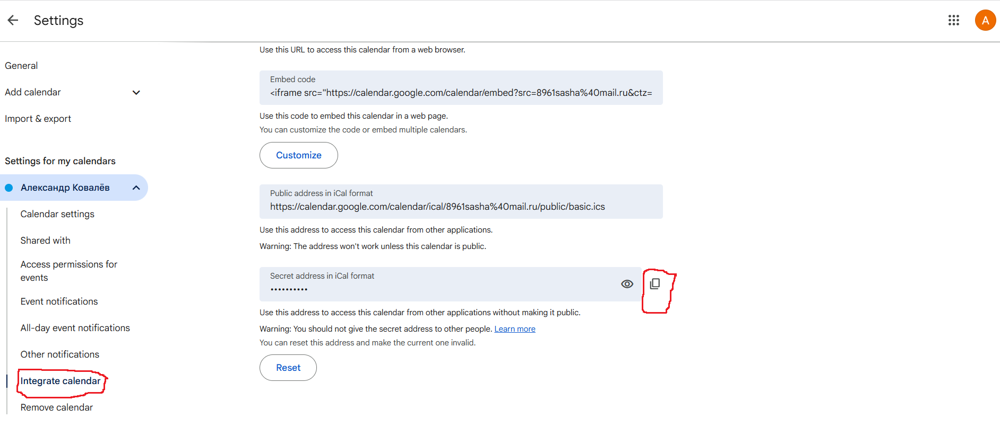

### Yandex calendar

1. Open your yandex calendar.
2. Press "Settings" for your calendar.

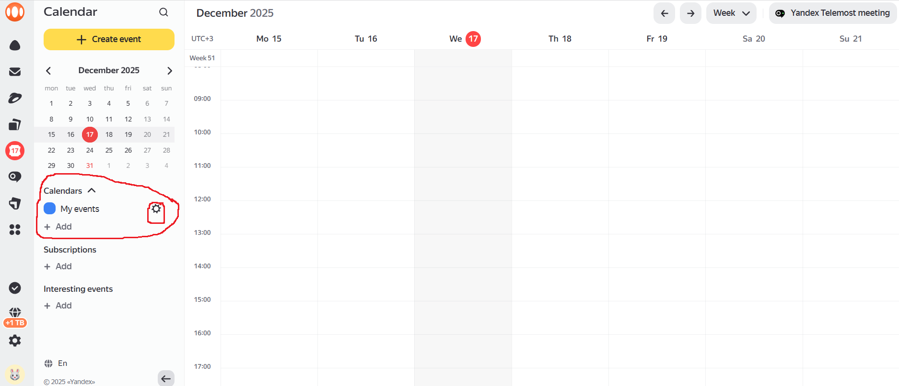

3. Click "Export".

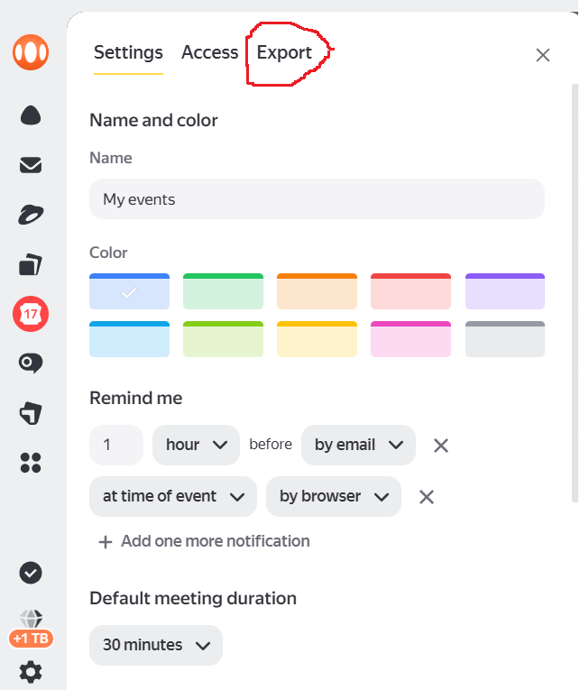

4. Copy ICal link.

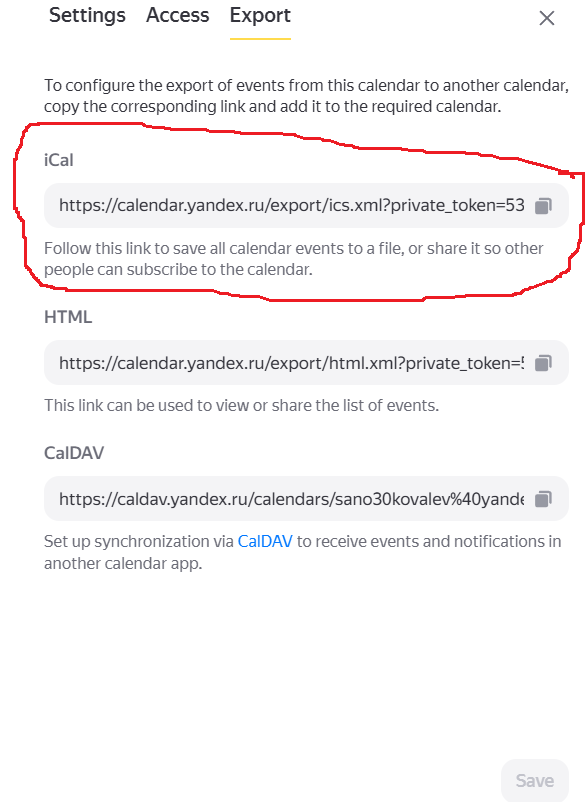

### Outlook calendar

1. Open your Outlook calendar.
2. Press "Calendar settings".

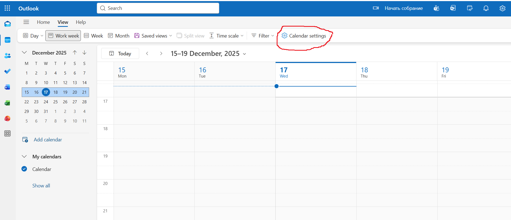

3. Press "Shared calendars".

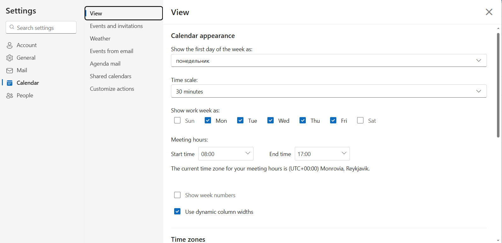

4. Select a calendar.

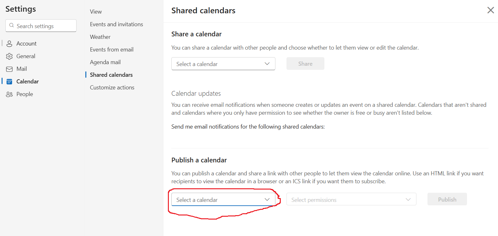

5. Press select permission and choose "Can view all details"

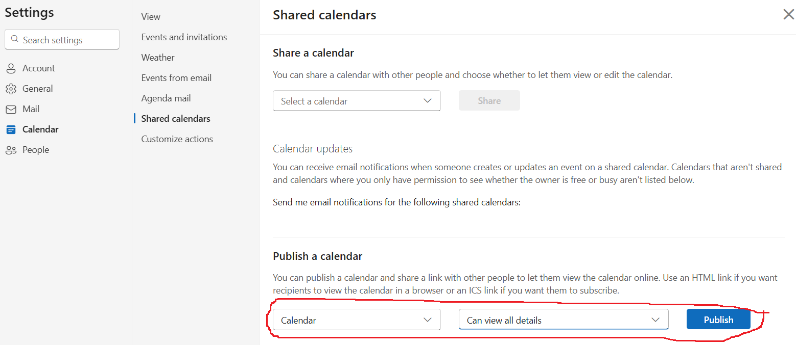

6. Press "Publish"
7. An ics link will appear at the bottom
8. Press on ics link and click "copy link"

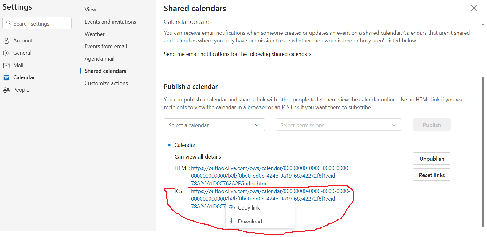