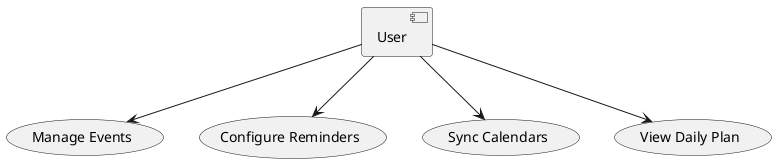
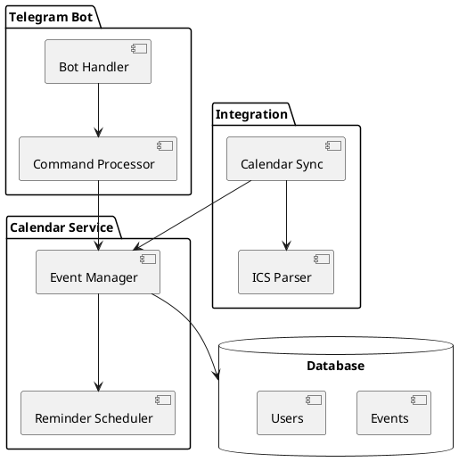

# Architecture

## Table of Contents

- [Interactive prototype](#interactive-prototype)
- [Context diagram](#context-diagram)
- [Use case diagram](#use-case-diagram)
- [Component diagram](#component-diagram)
- [Sequence diagrams](#sequence-diagrams)

## Interactive prototype

[Link to Figma prototype]

## Context diagram


**External actors:**
- User
- Google Calendar
- Outlook Calendar
- Telegram Bot API

## Use case diagram



**Actors:**
- User

## Component diagram



**Components:**
- Bot Handler - receives and routes Telegram messages
- Command Processor - processes user commands
- Event Manager - CRUD operations for events
- Reminder Scheduler - manages notification timing
- Calendar Sync - synchronizes external calendars
- ICS Parser - parses iCal format files

### Sequence diagrams

#### User Story: Create Event

```plantuml
@startuml
User -> Bot Handler: /create event
Bot Handler -> Command Processor: parse command
Command Processor -> Event Manager: create event
Event Manager -> Database: save event
Database --> Event Manager: event saved
Event Manager --> Command Processor: success
Command Processor --> Bot Handler: confirmation
Bot Handler --> User: event created
@enduml
```

#### Quality Requirement: Reminder Response Time

```plantuml
@startuml
Reminder Scheduler -> Event Manager: get upcoming events
Event Manager -> Database: query events
Database --> Event Manager: events list
Event Manager --> Reminder Scheduler: events
Reminder Scheduler -> Bot Handler: send notification
Bot Handler -> User: reminder message
@enduml
```

