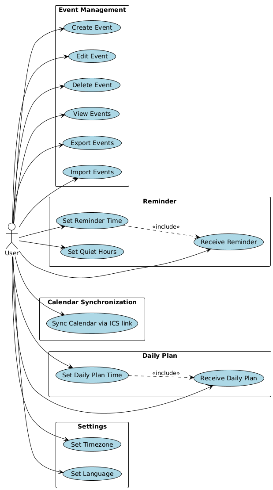
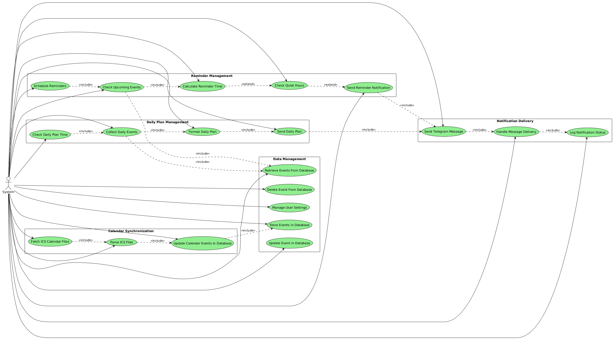
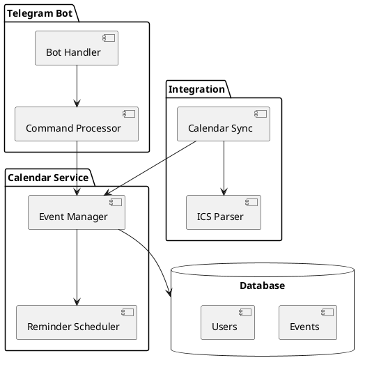

# Architecture

## Table of Contents

- [Interactive prototype](#interactive-prototype)
- [Context diagram](#context-diagram)
- [Use case diagram](#use-case-diagram)
- [Component diagram](#component-diagram)
- [Sequence diagrams](#sequence-diagrams)

## Interactive prototype

[Link to Figma prototype]

## Context diagram

| Actor               | Description                                                                  |
| ------------------- | ---------------------------------------------------------------------------- |
| Calendar ICal       | Calendar API that allow us to get `.ics` files                               |
| Telegram bot API    | Telegram API that allow us to use telegram app as client side for our system |
| User                | Person who interacs with tg bot and also hosting our system                  |
| Software components | Software that user need to install to hosting our system (example: Docker)   |

## Use case diagram

Чтобы не переусложнять диаграмму мы не добавили на нее TG API и Calendar API и нашу систему, т.к. нас интересует только то, как пользователь взаимдодействует с системой.

**Actors:**

- User

## Component diagram

**Components:**

- Bot Handler - receives and routes Telegram messages
- Command Processor - processes user commands
- Event Manager - CRUD operations for events
- Reminder Scheduler - manages notification timing
- Calendar Sync - synchronizes external calendars
- ICS Parser - parses iCal format files

### Sequence diagrams

#### User Story: Create Event

#### Quality Requirement: Reminder Response Time
