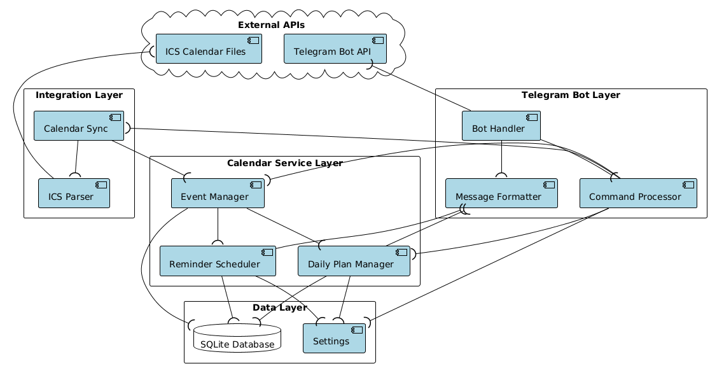
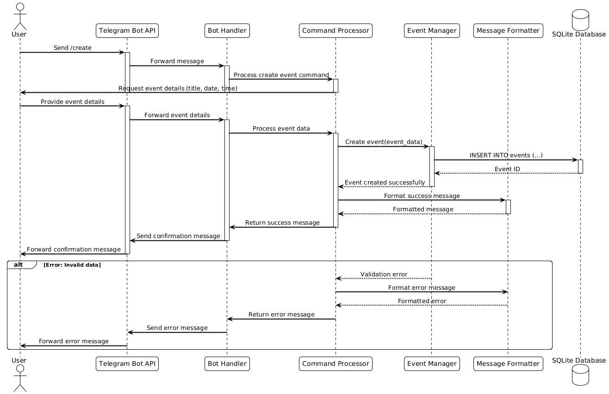
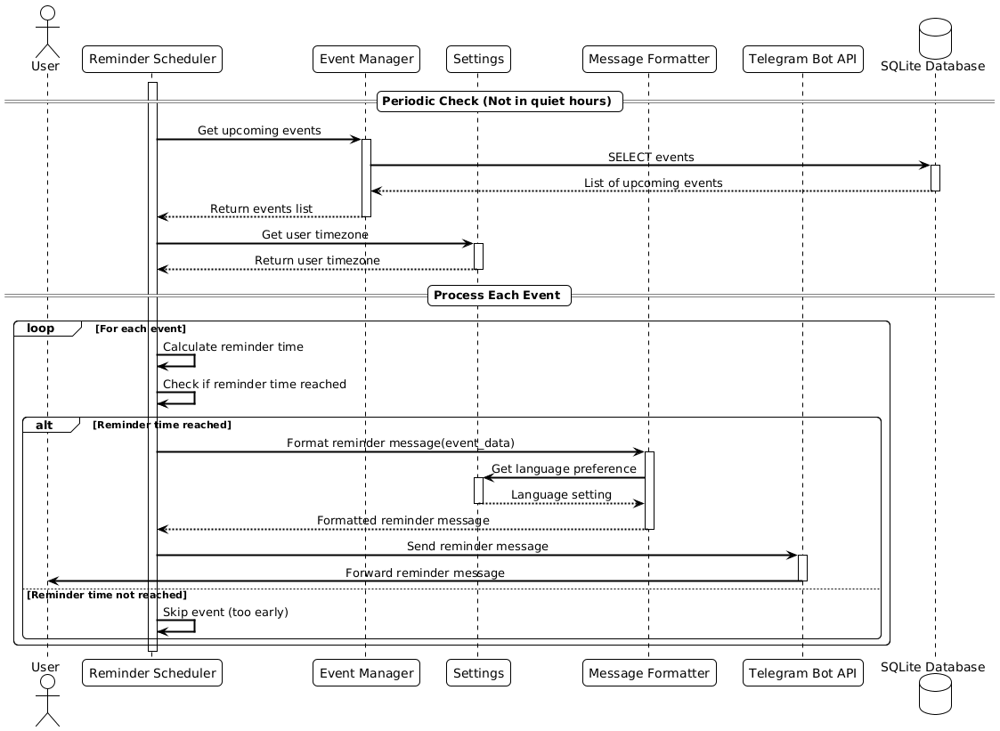
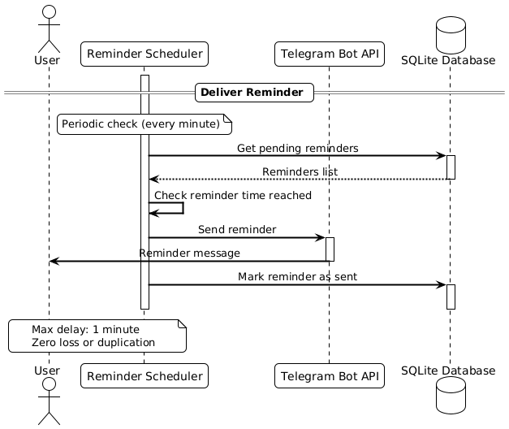
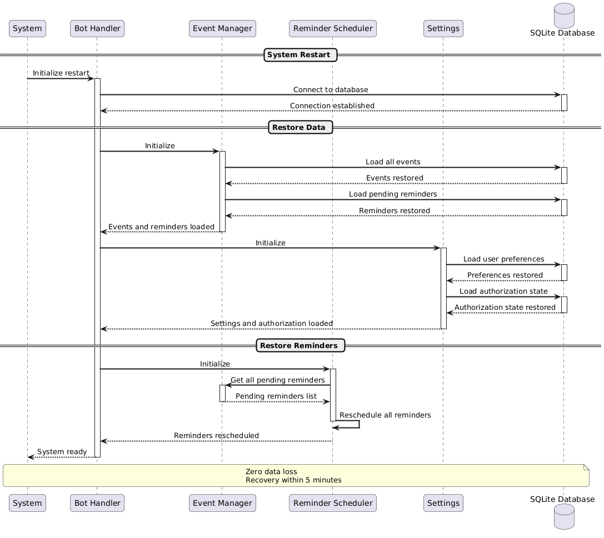

# Architecture

## Table of Contents

- [Interactive prototype](#interactive-prototype)
- [Context diagram](#context-diagram)
- [Use case diagram](#use-case-diagram)
- [Component diagram](#component-diagram)
- [Architectural decisions](#architectural-decisions)
- [Sequence diagrams](#sequence-diagrams)

## Interactive prototype

[Link to Figma prototype](https://www.figma.com/design/LqJOtos5K1Q8AW5yhVRDQR/Untitled?node-id=0-1&t=4I1YahX6Z5dIGkPU-1)

## Context diagram

| Actor               | Description                                                                  |
| ------------------- | ---------------------------------------------------------------------------- |
| Calendar ICal       | Calendar API that allow us to get `.ics` files                               |
| Telegram bot API    | Telegram API that allow us to use telegram app as client side for our system |
| User                | Person who interacs with tg bot and also hosting our system                  |
| Software components | Software that user need to install to hosting our system (example: Docker)   |

## Use case diagram

Чтобы не переусложнять диаграмму мы не добавили на нее TG API и Calendar API и нашу систему, т.к. нас интересует только то, как пользователь взаимдодействует с системой.

| Actor  | Description                                                                |
| ------ | -------------------------------------------------------------------------- |
| User   | Person who interacts with system via TG bot interface                      |
| System | Our personal calendar that store and manage events and throw notifications |

## Component diagram

| Component          | Layer                  | Responsibilities                                                                                                        |
| ------------------ | ---------------------- | ----------------------------------------------------------------------------------------------------------------------- |
| Bot Handler        | Telegram Bot Layer     | Receives messages from Telegram API, routes commands to Command Processor, coordinates with Message Formatter           |
| Command Processor  | Telegram Bot Layer     | Processes user commands, coordinates with Event Manager, Calendar Sync, Daily Plan Manager, and Settings                |
| Message Formatter  | Telegram Bot Layer     | Formats messages for Telegram API output, prepares reminders and notifications                                          |
| Event Manager      | Calendar Service Layer | Manages CRUD operations for events, stores data in database, coordinates with Reminder Scheduler and Daily Plan Manager |
| Reminder Scheduler | Calendar Service Layer | Schedules and sends event reminders, respects quiet hours, formats reminder messages                                    |
| Daily Plan Manager | Calendar Service Layer | Generates and sends daily event summaries, uses user settings for timing and format                                     |
| Calendar Sync      | Integration Layer      | Synchronizes external calendar data, coordinates with ICS Parser and Event Manager                                      |
| ICS Parser         | Integration Layer      | Parses ICS calendar files from external sources, extracts event data                                                    |
| Settings           | Data Layer             | Manages user settings and preferences (timezone, quiet hours, notification frequency)                                   |
| SQLite Database    | Data Layer             | Stores persistent data including events and settings                                                                    |
| Telegram Bot API   | External APIs          | External API for receiving commands and sending messages to users                                                       |
| ICS Calendar Files | External APIs          | External source for calendar data in ICS format                                                                         |

## Architectural decisions

This section describes the relevant architectural decisions that resulted in the current architecture.

| Driver                                                                          | Decision                                                                                                         | Rationale                                                                                                                                                                                       | Discarded Alternatives                                                                                                                                                              |
| ------------------------------------------------------------------------------- | ---------------------------------------------------------------------------------------------------------------- | ----------------------------------------------------------------------------------------------------------------------------------------------------------------------------------------------- | ----------------------------------------------------------------------------------------------------------------------------------------------------------------------------------- |
| QAS002: Reliable Reminder Scheduling                                            | Implement reminder scheduler that stores only the nearest notification and use event-based model instead pooling | - Avoids delays in notifications - Eliminates need for notification queues - Prevents constant polling of all events - Reduces memory usage and complexity                             | - Storing notification queues: Would require more memory and complex queue management - Polling all events periodically: Would cause delays and unnecessary resource consumption |
| CON-3: Easy setup & CON-2: Self-hosting with Docker Compose & US-014: Self-host | Use Docker for self-hosting deployment                                                                           | - Simplifies deployment process - Provides consistent environment across different systems - Aligns with self-hosting requirement - Enables easy setup if user already has docker      | - Deployment without containerization: Would require manual environment setup and be more error-prone                                                                               |
| CON-4: Synchronize via ICS file links & US-006: Sync external calendar          | Use ICS links for calendar integration instead of calendar API authorization                                     | - Simple integration with external calendars - No need for OAuth/authentication per calendar service - Works with any calendar that provides ICS export - Reduces security complexity  | - Authorization to each calendar service: Would require OAuth implementation for each provider and increase complexity                                                              |
| CON-7: Open-source, MIT license                                                 | Adopt layered service architecture with clear separation of concerns                                             | - Beneficial for open-source projects - Enables modular development and contributions - Improves code maintainability and testability - Facilitates understanding for new contributors | - Monolithic architecture: Would limit modularity and make contributions more difficult                                                                                             |
| CON-6: Single-user per instance & US-015: Single-user restriction               | One user per instance with no data storage or authorization system                                               | - Simplifies architecture significantly - No need for multi-user data management - Eliminates authentication complexity - Reduces security attack surface                              | - Authorization system: Would add unnecessary complexity for single-user use case - Configuration-based user management: Would still require user management infrastructure      |

### Sequence diagrams

#### US001

#### US009

#### QAS002

#### QAS007

